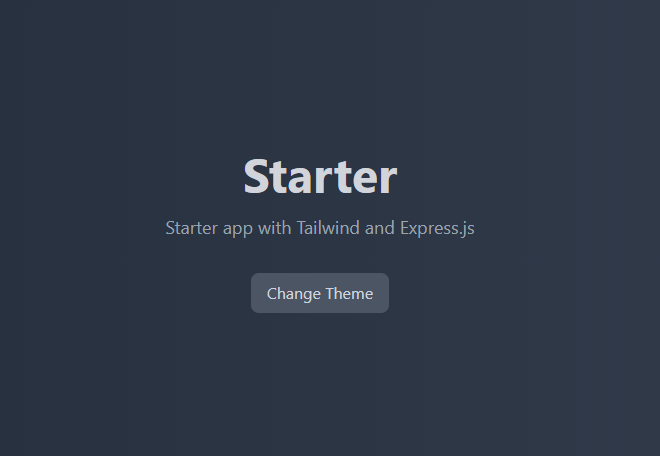

# Node Express Starter with Tailwind CSS



---

This project is a starter template for building web applications using Node.js, Express, and Tailwind CSS. It includes a basic Express server setup and Tailwind CSS configuration with automatic building and watching for changes.

## Table of Contents

- [Installation](#installation)
- [Usage](#usage)
- [Scripts](#scripts)
- [Project Structure](#project-structure)
- [License](#license)


## Installation

1. Create project folder
``` bash
mkdir node-express-starter
cd node-express-starter
```

2. Get the repo:
```bash
git clone https://github.com/your-username/node-express-starter.git
```

3. Install dependencies:
```bash
npm install
```


## Usage

### Start the Server

To start the Express server and watch for changes:
Use two terminals to run commands simultaneously for a smooth development experience

#### Terminals
```bash
#Terminal 01
npm start 

#Terminal 02
npx tailwindcss -i ./public/styles/tailwind.css -o ./public/styles/style.css --watch
```

#### Scripts

- `npm start`: Starts the Express server with `nodemon`
- `npx tailwindcss`: For rebuilding tailwind style


## Project Structure

``` bash
node-express-starter/
│
├── controllers/
│   └── index.js
|
├── public/
│   └── img/
│      └── hero.png
│   └── styles/
│      ├── tailwind.css
│      └── style.css
|
├── routes/
│   └── index.js
|
├── views/
│   └── index.ejs
│
├── tailwind.config.js
├── postcss.config.js
├── package.json
└── README.md
```